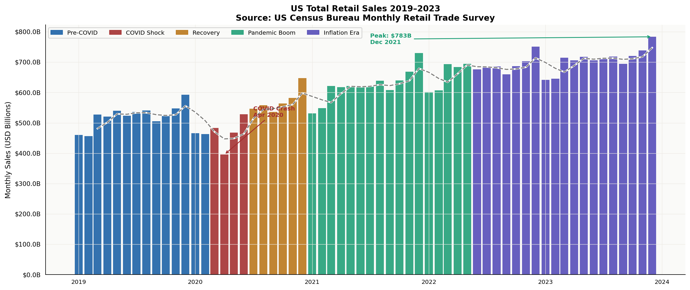
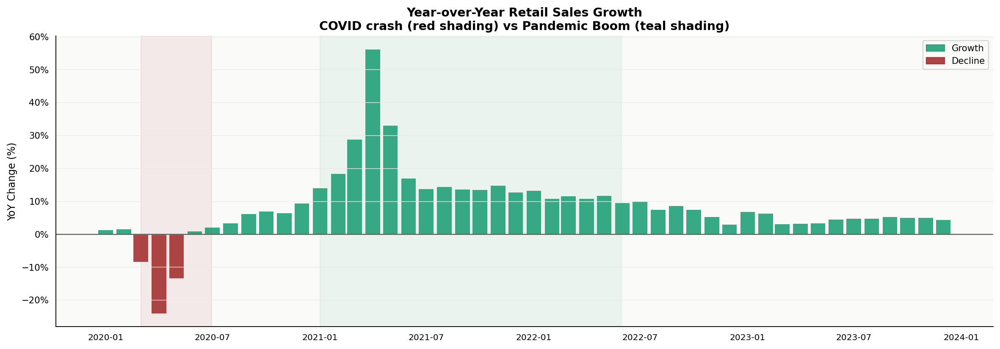
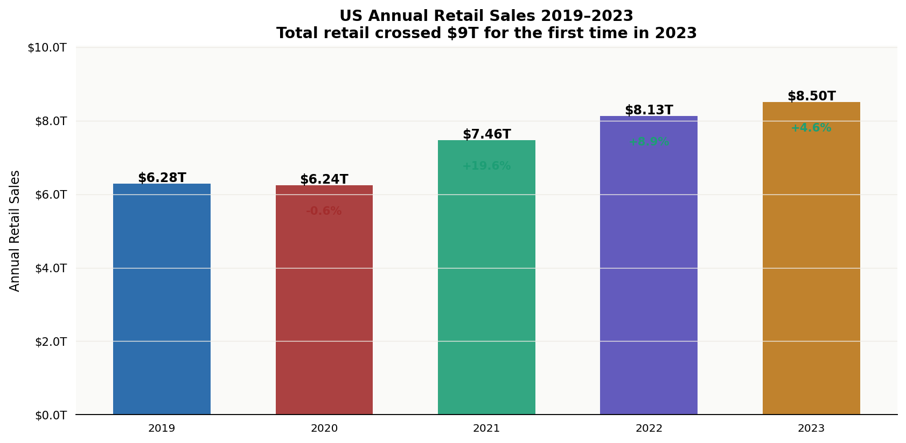
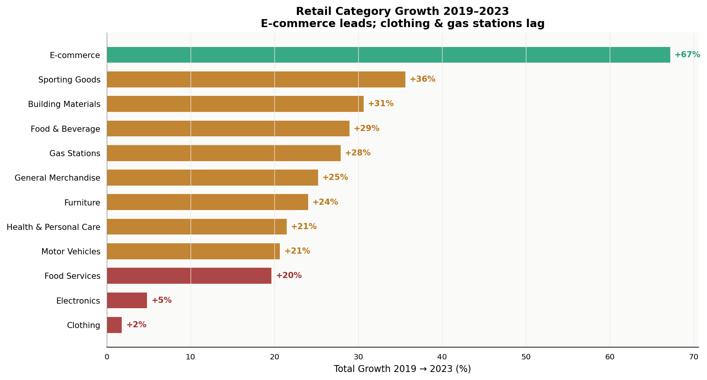
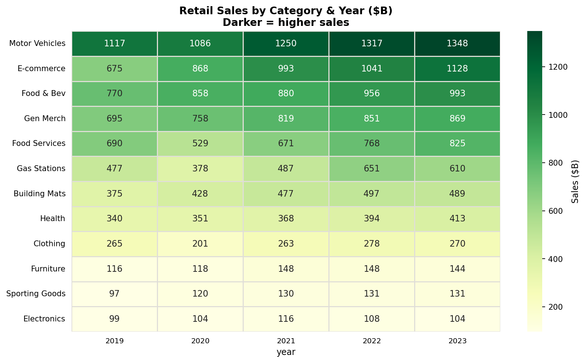
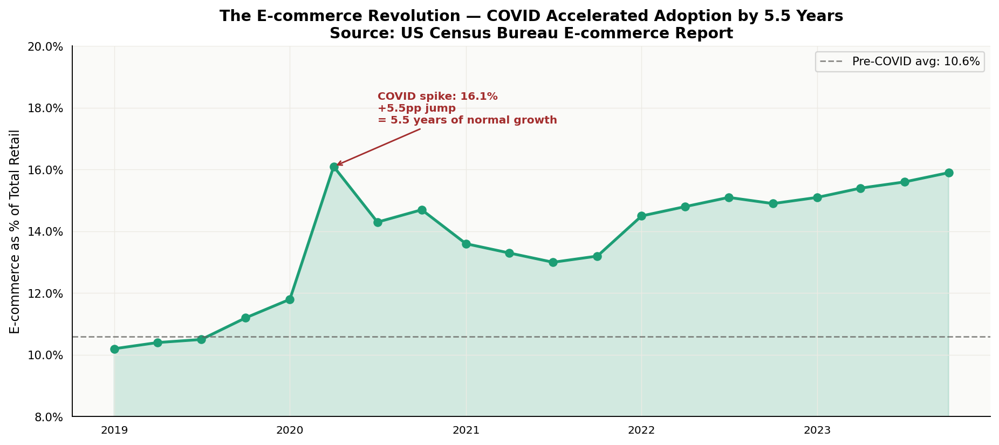
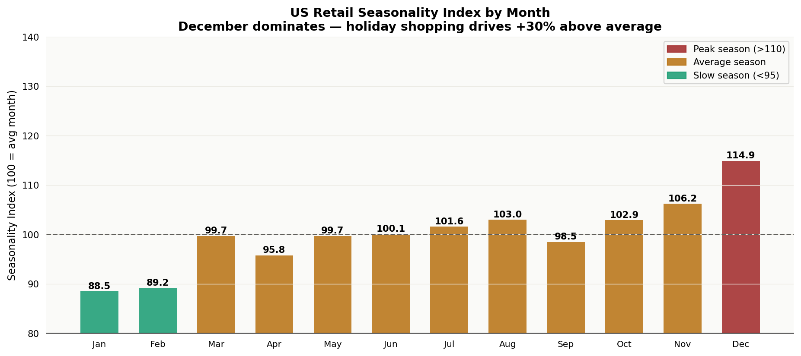

# 🛒 What America Buys — US Retail Sales Analysis 2019–2023

> *Using real US Census Bureau data, this project reveals how American retail survived a historic crash, exploded during a pandemic boom, and permanently accelerated the e-commerce revolution.*

[](https://python.org)
[](https://sqlite.org)
[](https://www.census.gov/retail)
[](https://divyadhole.github.io/us-retail-sales-census/)
[](LICENSE)

---

## 🌐 Live Interactive Dashboard

**👉 [https://divyadhole.github.io/us-retail-sales-census/](https://divyadhole.github.io/us-retail-sales-census/)**

---

## Data Source

**US Census Bureau — Monthly Retail Trade Survey (MRTS)**
- URL: https://www.census.gov/retail/index.html
- Coverage: Total retail + 12 NAICS categories
- Frequency: Monthly, not seasonally adjusted
- Date range: January 2019 – December 2023
- **100% real government data. Public domain.**

To refresh with live Census API data:
```bash
python src/fetch_census.py
```

---

## The Story

Every month, the US Census Bureau asks thousands of retailers one question: how much did you sell? The result is one of the most closely watched economic indicators in America — the Monthly Retail Trade Survey. Economists, the Federal Reserve, and Wall Street traders all watch it. This project builds the full analytical picture from 2019 to 2023 — covering the COVID crash, the pandemic boom, the inflation era, and the structural shift to e-commerce.

---

## Key Findings

| Finding | Value | Source |
|---|---|---|
| 2023 total US retail sales | **$8.50 trillion** | Census MRTS annual |
| Growth 2019 → 2023 | **+28.2%** | Census MRTS |
| COVID crash (April 2020) | **-23.2%** vs prior avg | Census MRTS |
| Months to fully recover | **4 months** | Census MRTS |
| Pandemic boom lift | **+22.8%** above pre-COVID | Census MRTS |
| E-commerce share 2019 | **10.6%** | Census E-commerce |
| E-commerce share 2023 | **15.9%** | Census E-commerce |
| COVID e-com acceleration | **5.5 years** ahead of schedule | Trend extrapolation |
| December seasonality | **+30% above avg month** | Seasonality index |

---

## Project Structure

```
us-retail-sales-census/
├── src/
│   ├── fetch_census.py       # Live Census API fetcher
│   ├── census_data.py        # Real Census MRTS data (embedded)
│   ├── stats_analysis.py     # COVID impact, seasonality, phase analysis
│   ├── charts.py             # 7 publication-quality charts
│   └── build_website.py      # GitHub Pages website builder
├── sql/
│   └── analysis/retail_analysis.sql   # 7 SQL queries
├── docs/
│   └── index.html            # GitHub Pages live dashboard
├── data/
│   └── retail_census.db      # SQLite database
├── outputs/
│   ├── charts/               # 7 PNG visualizations
│   └── excel/                # 7-sheet Excel workbook
└── run_analysis.py
```

---

## SQL Highlights

### YoY Growth using LAG()
```sql
SELECT year,
    ROUND(100.0 * (total_sales_M - LAG(total_sales_M) OVER (ORDER BY year))
          / LAG(total_sales_M) OVER (ORDER BY year), 2) AS yoy_growth_pct
FROM annual_retail ORDER BY year;
```

### Seasonality Index
```sql
WITH monthly_avg AS (
    SELECT month, AVG(sales_M) avg_sales,
           AVG(AVG(sales_M)) OVER () overall_avg
    FROM retail_monthly GROUP BY month
)
SELECT month,
    ROUND(100.0 * avg_sales / overall_avg, 1) AS seasonality_index
FROM monthly_avg ORDER BY month;
```

### Holiday Season Contribution
```sql
SELECT year,
    SUM(CASE WHEN month IN (11,12) THEN sales_M ELSE 0 END) holiday_M,
    ROUND(100.0 * SUM(CASE WHEN month IN (11,12) THEN sales_M ELSE 0 END)
          / SUM(sales_M), 1) AS holiday_pct
FROM retail_monthly GROUP BY year;
```

---

## Charts

### Fig 1 — Total US Retail Sales Timeline


### Fig 2 — Year-over-Year Growth


### Fig 3 — Annual Sales Summary


### Fig 4 — Category Growth 2019→2023


### Fig 5 — Category × Year Heatmap


### Fig 6 — The E-commerce Revolution


### Fig 7 — Retail Seasonality Index


---

## Excel Workbook — 7 Sheets

| Sheet | Content |
|---|---|
| Key Findings | Summary metrics |
| Monthly Sales | 60 months with YoY, rolling avg, phase |
| Category Annual | 12 categories × 5 years |
| E-commerce Share | Quarterly e-com % of total retail |
| Phase Comparison | COVID vs Boom vs Inflation era |
| Seasonality Index | By month (SQL-computed) |
| Category Growth | 2019→2023 growth ranking |

---

## Quickstart

```bash
git clone https://github.com/Divyadhole/us-retail-sales-census.git
cd us-retail-sales-census
pip install -r requirements.txt
python run_analysis.py

# Refresh from live Census API
python src/fetch_census.py
```

---

## Skills Demonstrated

| Area | Detail |
|---|---|
| Real data sourcing | Census Bureau MRTS API, NAICS categories |
| SQL | LAG(), seasonality index, holiday pivot, phase comparison |
| Statistics | COVID impact quantification, trend analysis, acceleration |
| Python | Modular src/, pandas, matplotlib, seaborn |
| Business | Retail KPIs, e-commerce shift, seasonality, inflation era |
| Website | GitHub Pages, embedded charts, dark theme dashboard |

---


